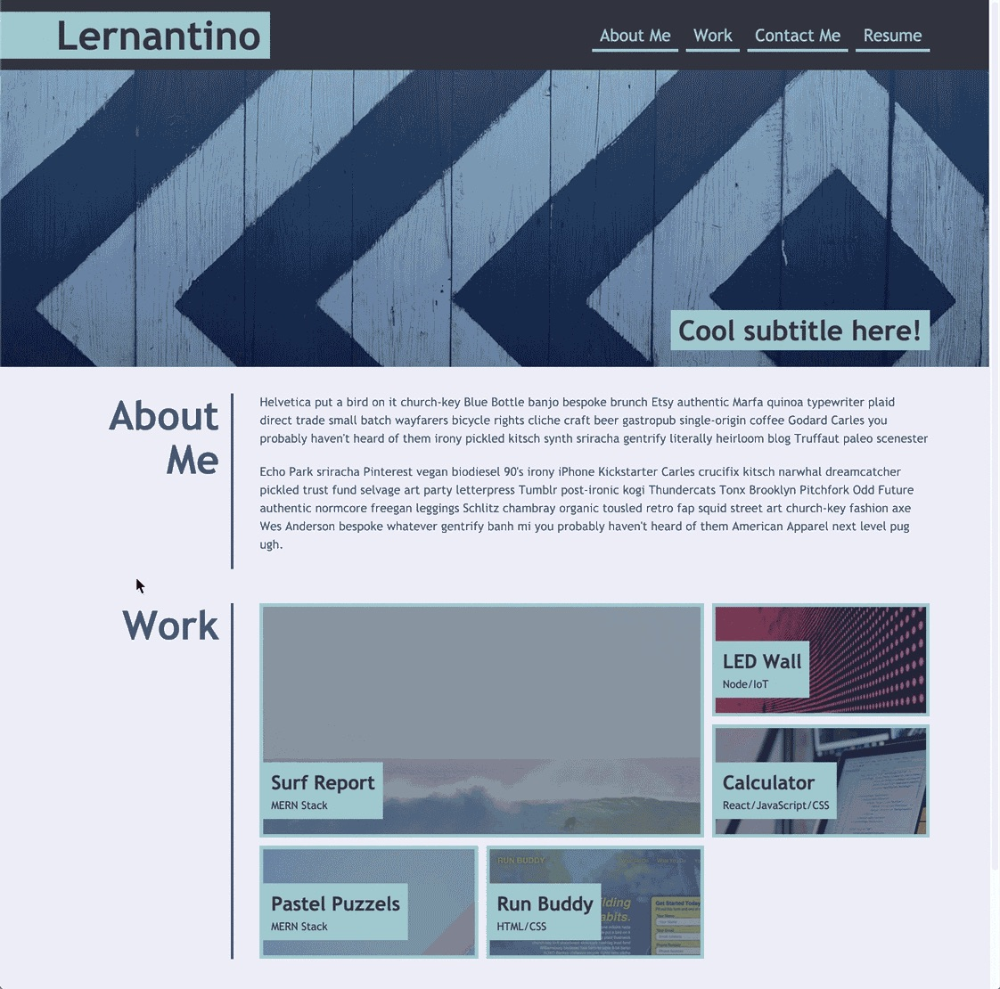

# Create Your Portfolio
​
This challenge required us to write our own code from scratch to design a portfolio. This was so we could use Advanced CSS like flexboxes, grids, and media queries.
​
## Acceptance Criteria
​
GIVEN I need to sample a potential employee's previous work

WHEN I load their portfolio
THEN I am presented with the developer's name, a recent photo, and links to sections about them, their work, and how to contact them

WHEN I click one of the links in the navigation
THEN the UI scrolls to the corresponding section

WHEN I click on the link to the section about their work
THEN the UI scrolls to a section with titled images of the developer's applications

WHEN I am presented with the developer's first application
THEN that application's image should be larger in size than the others

WHEN I click on the images of the applications
THEN I am taken to that deployed application

WHEN I resize the page or view the site on various screens and devices
THEN I am presented with a responsive layout that adapts to my viewport

​
## Additional Information

### Note to the Reader
I ran out of time and was unable to crack the CSS grid needed for the images in the Work section as well as the media queries. 
​
### Mock Up
​
Here is a mock-up I have used to model the design of this portfolio:

Mock Up:

​
### Access Application
​
You can find the portfolio here:
* https://isibee.github.io/portfolio-challenge/

You can find the code here:
* https://github.com/IsiBee/portfolio-challenge